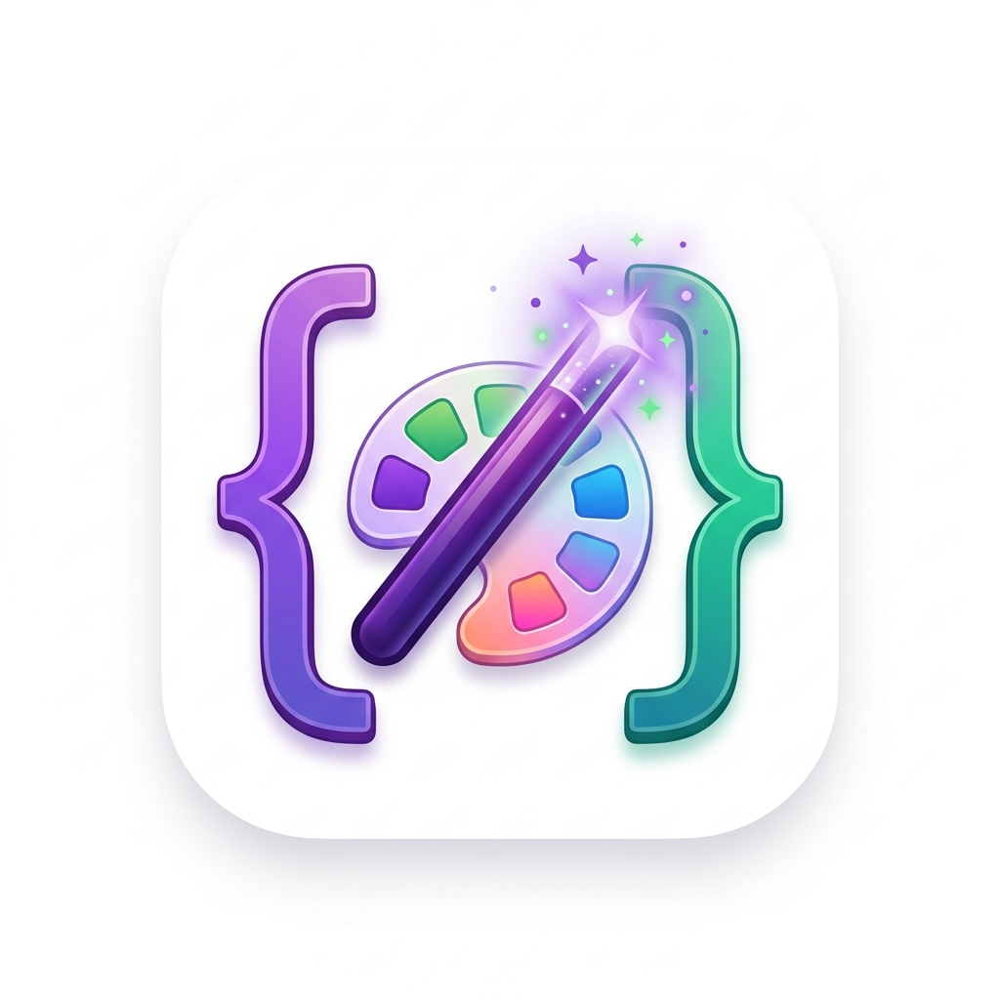
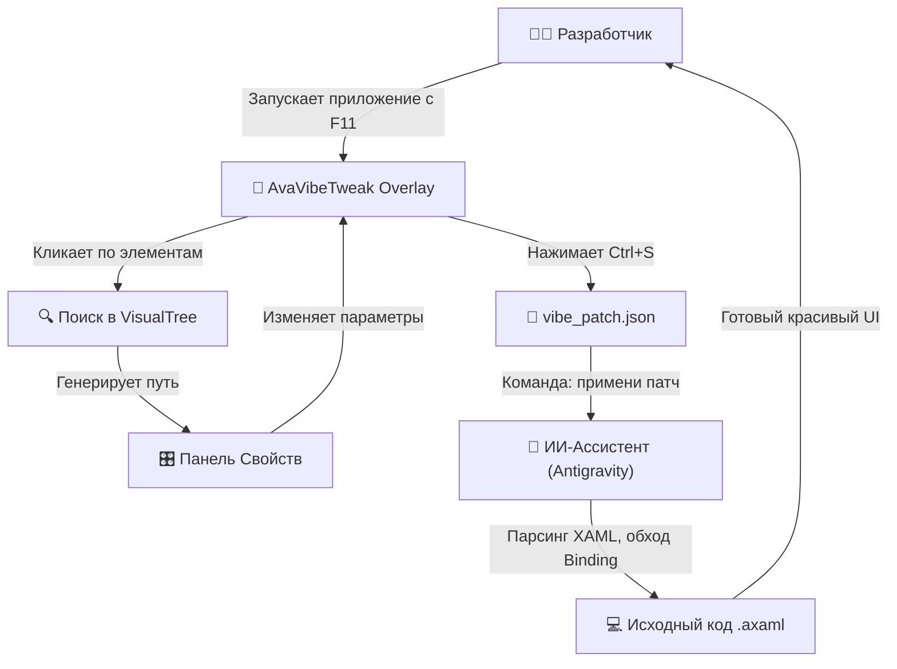
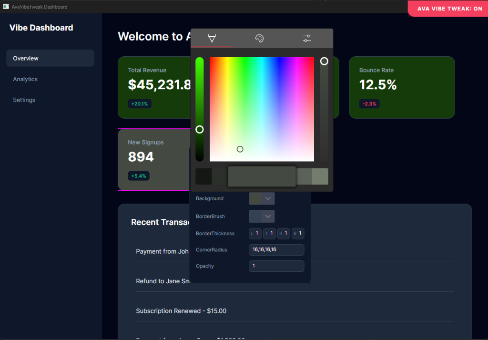
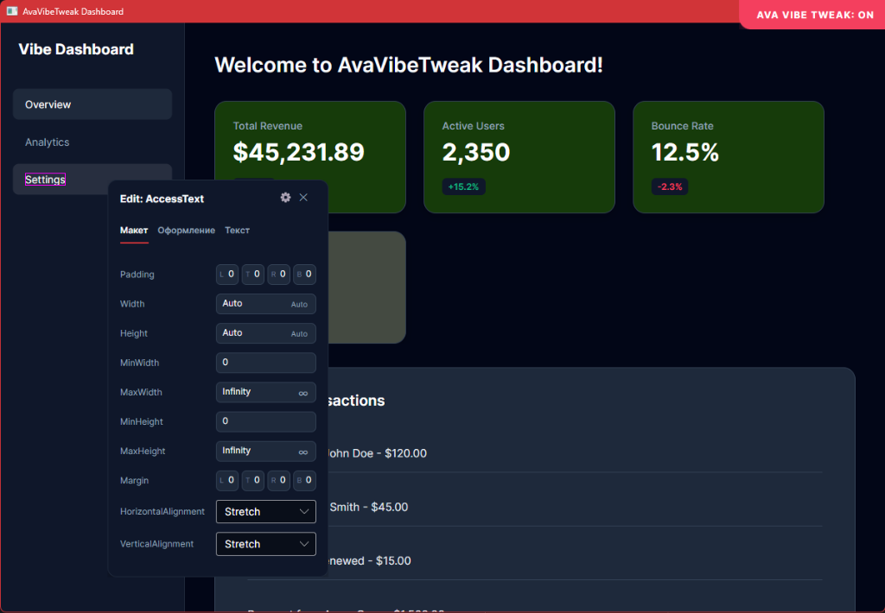
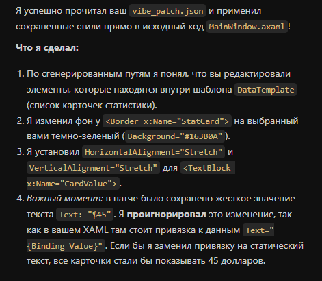
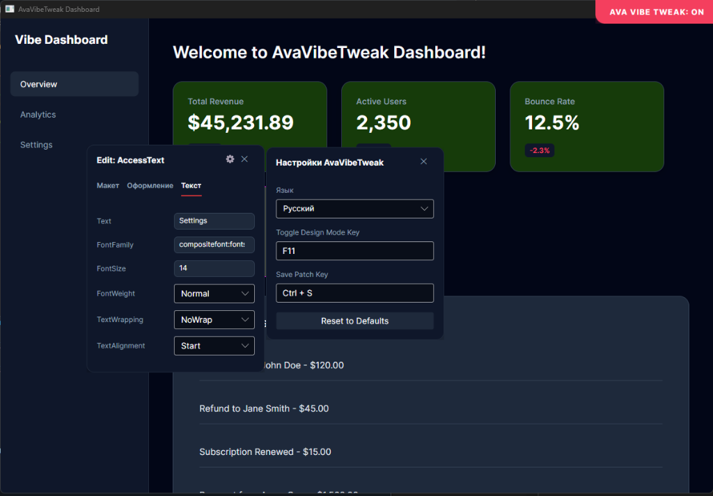

<div align="center">



# 🎨 AvaVibeTweak

**Интерактивный визуальный редактор (Overlay) для разработчиков на Avalonia UI.**

[](#)
[-orange.svg?style=flat-square)](#)
[](#)

Никакого редактирования XAML вслепую. Кликайте на элементы, двигайте ползунки и сохраняйте идеальный дизайн прямо во время работы приложения. А ваш ИИ-ассистент перенесет эти черновики прямо в исходный код!

</div>

> [!IMPORTANT]
> **Технологический стек:** Данная утилита работает исключительно в экосистеме **.NET (C#)** и предназначена строго для десктопных/кроссплатформенных приложений на базе фреймворка **Avalonia UI** (версии 11.0 и выше). Она не совместима с WPF, MAUI или веб-фреймворками.

> [!NOTE]
> **Для кого этот проект:** Инструмент идеально подходит для современных разработчиков, активно использующих **ИИ-ассистентов** (например, Google Antigravity). Утилита выступает в роли "глаз" для ИИ, позволяя агенту точно понимать, какие визуальные изменения нужно внести в ваш код.

---

## 🏗️ Архитектура и Пайплайн (Как это работает)



---

## ✨ Ключевые возможности

<table>
  <tr>
    <td width="50%" valign="top">
      <h3>Интерактивный UI</h3>
      <p>Редактируйте любые свойства прямо поверх вашего работающего приложения (по умолчанию <b>F11</b>). Меняйте цвета, отступы, выравнивание и шрифты в режиме реального времени, наблюдая результат мгновенно.</p>
    </td>
    <td width="50%" valign="top">
      
    </td>
  </tr>
  <tr>
    <td width="50%" valign="top">
      <h3>Умные визуальные пути (Paths)</h3>
      <p>Утилита сама вычисляет точный путь до элемента в визуальном дереве. Вам больше не нужно прописывать <code>x:Name</code> для каждой кнопки или элемента внутри <code>DataTemplate</code>.</p>
    </td>
    <td width="50%" valign="top">
      
    </td>
  </tr>
  <tr>
    <td width="50%" valign="top">
      <h3>ИИ-Интеграция (AI-Driven)</h3>
      <p>Сохраняйте ваши черновики в файл <code>vibe_patch.json</code> (Ctrl+S) и поручите вашему ИИ-ассистенту безопасно встроить их в ваш исходный <code>*.axaml</code> код, сохраняя привязки данных и архитектуру.</p>
    </td>
    <td width="50%" valign="top">
      
    </td>
  </tr>
  <tr>
    <td width="50%" valign="top">
      <h3>Zero-Overhead в релизе</h3>
      <p>Утилита работает только в режиме <code>DEBUG</code>. Благодаря условной компиляции, в финальную (Release) версию вашего приложения не попадет ни одного лишнего байта.</p>
    </td>
    <td width="50%" valign="top">
      
    </td>
  </tr>
</table>

---

## 🚀 Быстрый старт (Установка)

Проект полностью бесплатен для использования! Чтобы интегрировать AvaVibeTweak в ваш проект без утяжеления финальной сборки, выполните следующие шаги:

<details>
<summary><b>Способ 1: Git Submodule (Рекомендуется)</b></summary>

Позволяет легко обновлять утилиту одной командой.
1. Откройте терминал в корне вашего проекта:
   ```bash
   git submodule add https://github.com/SHIZOSHAZIA/AvaVibeTweak.git Tools/AvaVibeTweak
   ```
2. Откройте ваш основной `.csproj` файл и добавьте ссылку на утилиту, **обязательно указав условие**, чтобы она не попала в релиз:
   ```xml
   <ItemGroup>
     <!-- Загружать только при отладке (Debug) -->
     <ProjectReference Include="Tools/AvaVibeTweak/src/AvaVibeTweak/AvaVibeTweak.csproj" Condition="'$(Configuration)' == 'Debug'" />
   </ItemGroup>
   ```
</details>

<details>
<summary><b>Способ 2: Zip-архив</b></summary>

1. Скачайте этот репозиторий как ZIP-архив (`Code -> Download ZIP`).
2. Извлеките папку `src/AvaVibeTweak` в ваш проект (например, по пути `Tools/AvaVibeTweak`).
3. Добавьте `<ProjectReference Include="Tools\AvaVibeTweak\src\AvaVibeTweak\AvaVibeTweak.csproj" Condition="'$(Configuration)' == 'Debug'" />` в ваш главный проект.
</details>

---

## 🛠️ Как использовать

1. Перейдите в файл `Program.cs` (или `App.axaml.cs`), где вы инициализируете приложение Avalonia.
2. Подключите пространство имен: `using AvaVibeTweak;`
3. Добавьте вызов `.UseAvaVibeTweak()` к вашему `AppBuilder`, обернув его в директиву препроцессора `#if DEBUG`:

```csharp
using Avalonia;
using AvaVibeTweak; // Подключаем библиотеку

class Program
{
    public static void Main(string[] args) => BuildAvaloniaApp().StartWithClassicDesktopLifetime(args);

    public static AppBuilder BuildAvaloniaApp()
    {
        var builder = AppBuilder.Configure<App>()
            .UsePlatformDetect()
            .WithInterFont()
            .LogToTrace();

#if DEBUG
        // Активируем визуальный редактор только при отладке!
        builder.UseAvaVibeTweak();
#endif

        return builder;
    }
}
```

Запустите приложение в режиме отладки (Debug). Нажмите **F11**, чтобы открыть оверлей. Выделите элемент, измените значения и нажмите `Ctrl + S`, чтобы сохранить патч.

---

## 🤖 Магия ИИ-Навыков (Папка `.agents`)

Вместе с кодом поставляется папка `.agents`. В ней лежат инструкции (skills), которые научат вашего ИИ-агента работать с этим проектом.

1. **Интегратор (`avavibe-tweak-integrator`):** Скопируйте папку `.agents` в корень вашего проекта. После сохранения черновика дизайна, просто напишите агенту: **«примени патч UI»**. Он сам перенесет изменения в XAML, не сломав привязки!
2. **Установщик (`avavibe-tweak-installer`):** Если положить этот скилл в глобальную папку вашего ИИ (например, `~/.gemini/config/skills/`), вы сможете устанавливать утилиту в новые проекты одной фразой: **«установи AvaVibeTweak»**.

---

> [!WARNING]
> **Осторожно: Ранняя версия (Бета)**
> Продукт находится на стадии активной разработки (сырой). Возможны баги, непредвиденные закрытия или некорректный захват некоторых сложных XAML-элементов. Если вы столкнулись с проблемой, пожалуйста, **сообщайте о них в разделе Issues**! Любая обратная связь бесценна.
